# 🔍 Web Traffic Analysis & Threat Detection using Splunk

## 📌 Overview

This project demonstrates how I built a SIEM lab using Splunk to analyze Apache web server logs and detect suspicious activity.

The objective was to simulate a real-world cybersecurity workflow including log ingestion, analysis, visualization, and alerting.

---

## 🛠️ Tools & Technologies

* Splunk Enterprise
* Ubuntu (Virtual Machine)
* Apache Web Server Logs

---

## 📥 Log Ingestion Process

### Upload Log File

### Review File Before Upload

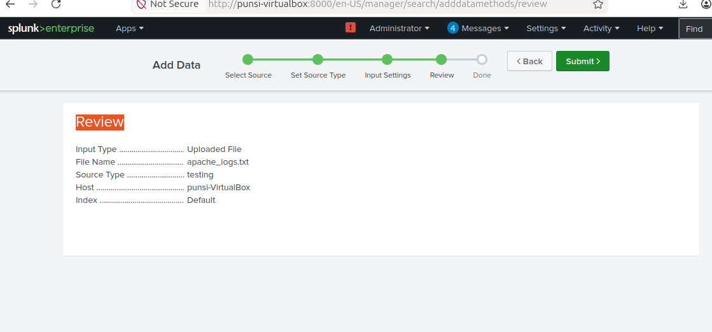

### Create Text Index

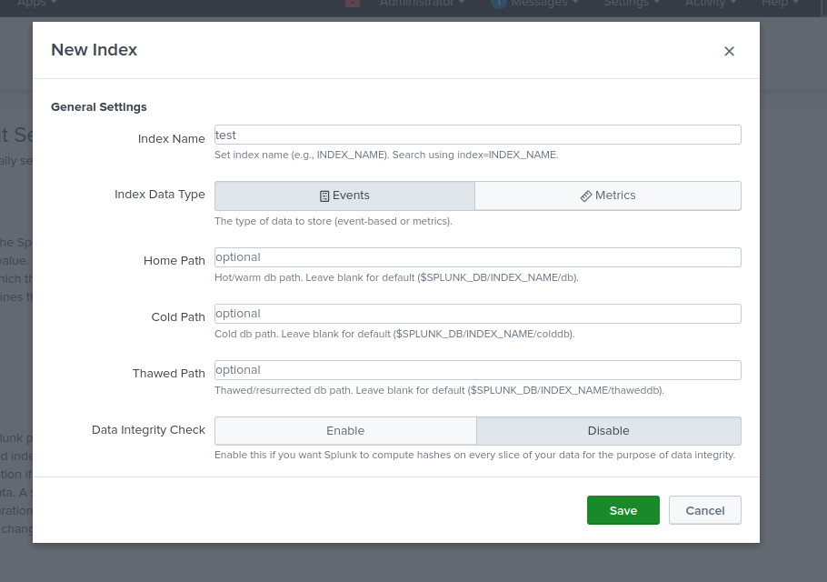

### Log Upload

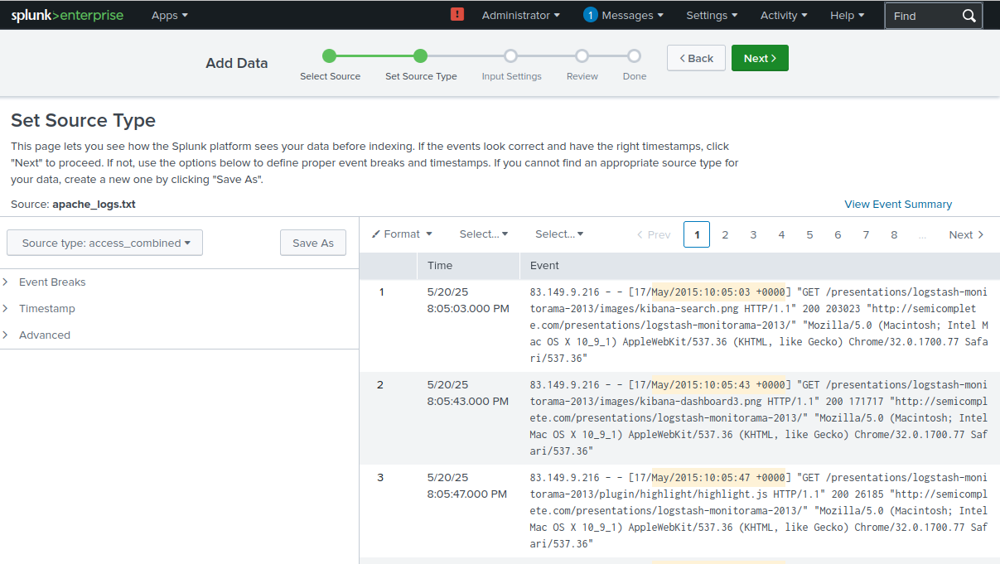

### Final Import Result

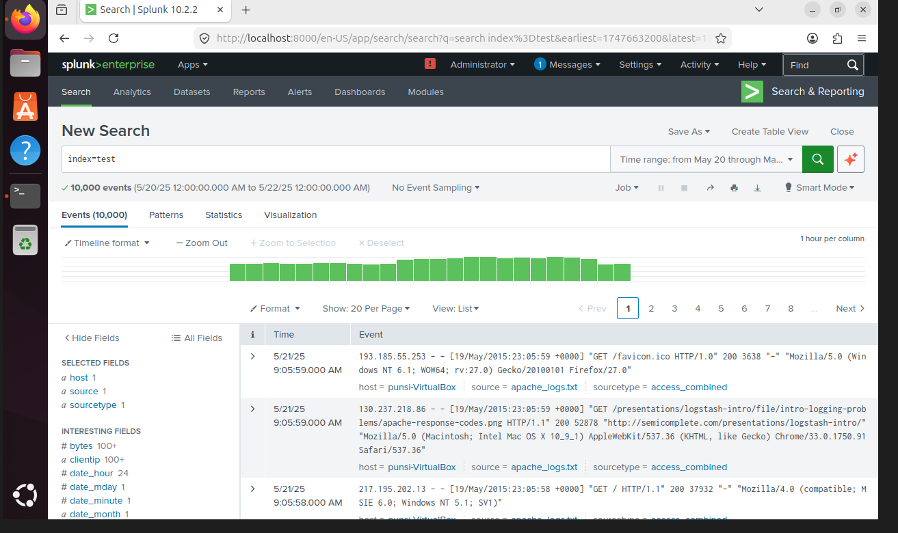

---

## 📊 Data Analysis

### Search Index Result

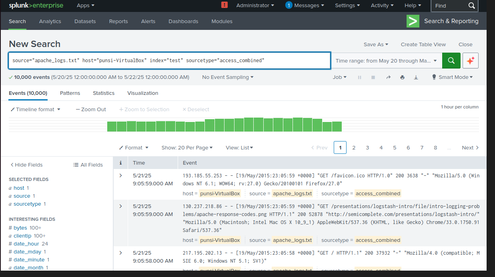

### Find Top IP Addresses

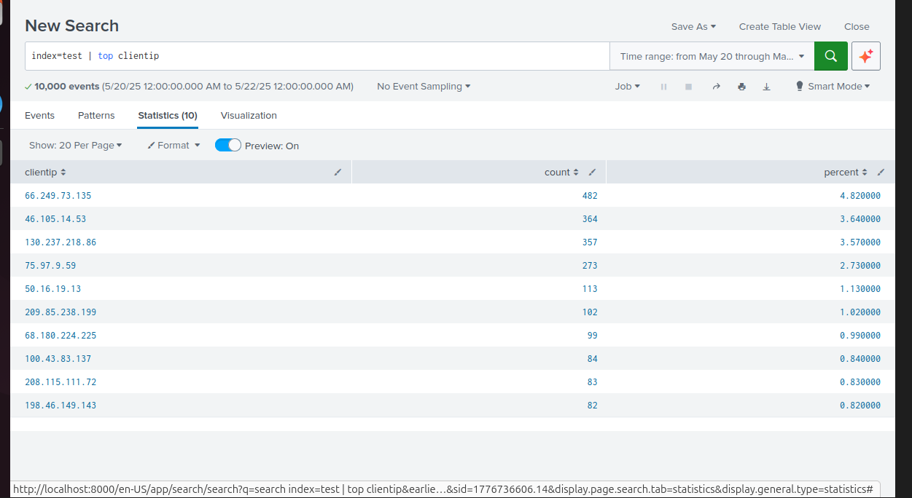

### Find Suspicious Activity

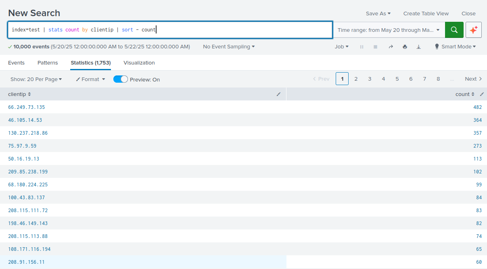

### Find Scanning Behavior

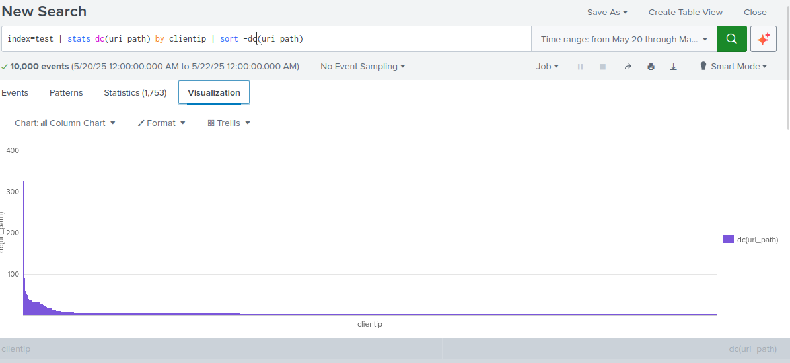

### Detect Possible Attack Patterns

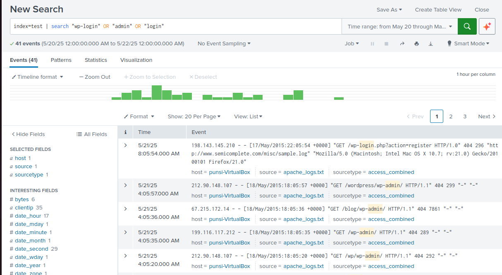

---

## 📈 Dashboard & Monitoring

### Build Dashboard

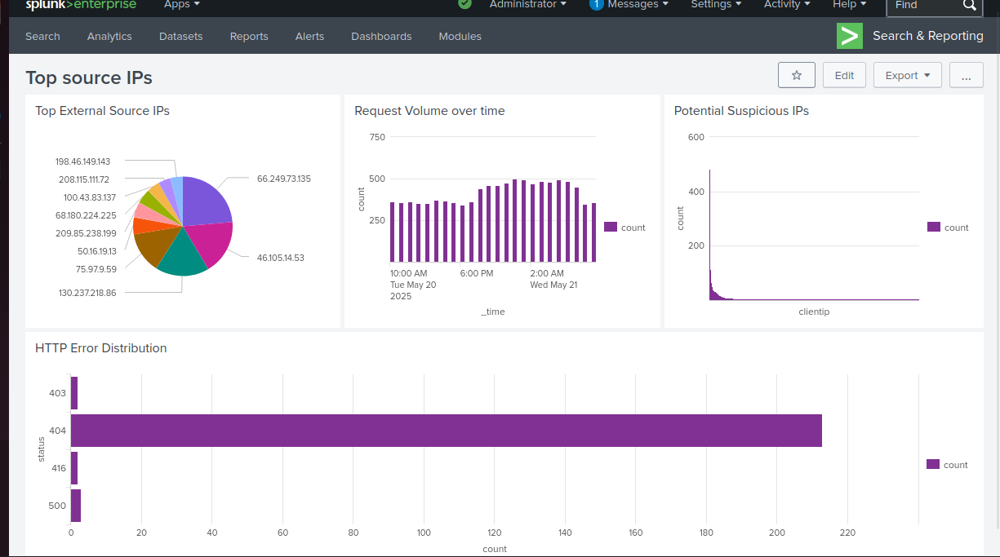

### Create Alert

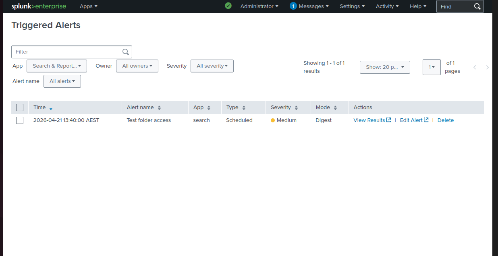

---

## 🔍 Key Findings

* Identified high-frequency IP addresses indicating potential malicious behavior
* Detected scanning activity through repeated endpoint access
* Observed unusual traffic patterns and HTTP error responses
* Created alerts for monitoring suspicious behavior

---

## 🎯 Skills Demonstrated

* SIEM setup and usage
* Log ingestion and indexing
* Splunk search queries (SPL)
* Security event analysis
* Dashboard creation
* Alert configuration

---

## 🚀 Conclusion

This project demonstrates practical hands-on experience with Splunk and simulates a real-world SOC workflow for detecting and monitoring suspicious activity.

---

## 🔮 Future Improvements

* Simulate brute-force and web-based attacks
* Integrate additional log sources (system logs, firewall logs)
* Improve alerting with severity levels and automation

---

