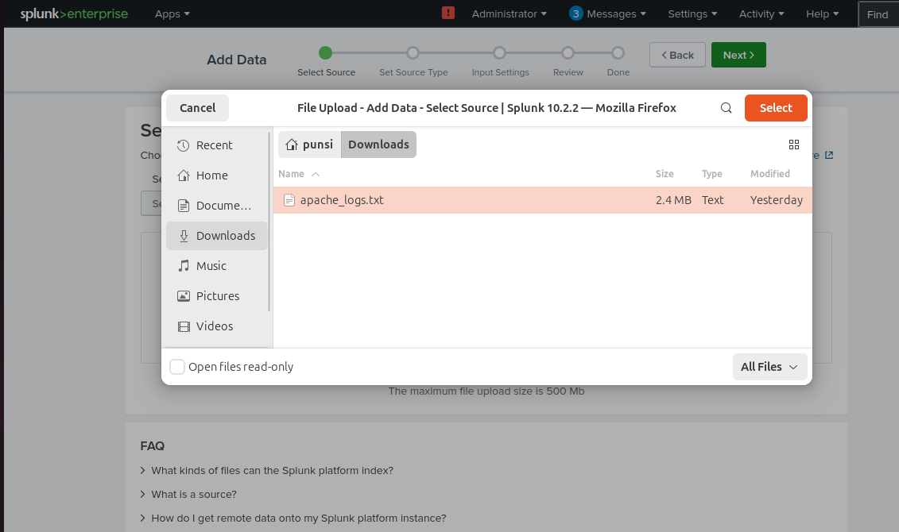

🔍 Web Traffic Analysis & Threat Detection using Splunk
📌 Overview

This project demonstrates how I built a SIEM lab using Splunk to analyze Apache web server logs and detect suspicious activity.

The objective was to simulate a real-world cybersecurity workflow including log ingestion, analysis, visualization, and alerting.

🛠️ Tools & Technologies
Splunk Enterprise
Ubuntu (Virtual Machine)
Apache Web Server Logs

📥 Log Ingestion Process
Upload Log File

Log Upload

Final Import Result

📊 Data Analysis
Search Index Result

Find Top IP Addresses

Find_top IP addresses.png

Find Suspicious Activity

Find Scanning Behavior

Detect Possible Attack Patterns

📈 Dashboard Creation
Build Dashboard

🚨 Alert Configuration
Create Alert

🔍 Key Findings
Identified high-frequency IP addresses indicating potential malicious behavior
Detected scanning activity through repeated endpoint access
Observed unusual traffic patterns and HTTP errors
Created alerts for real-time monitoring of suspicious activity
🎯 Skills Demonstrated
Log ingestion and indexing in Splunk
Writing and executing search queries
Security event analysis
Dashboard creation and visualization
Alert configuration for threat detection
🚀 Conclusion

This project demonstrates practical hands-on experience with a SIEM tool and reflects the core workflow used in real-world cybersecurity operations.

🔮 Future Improvements
Simulate real attack scenarios (brute force, SQL injection)
Integrate additional log sources (system logs, firewall logs)
Enhance alert severity and automation
